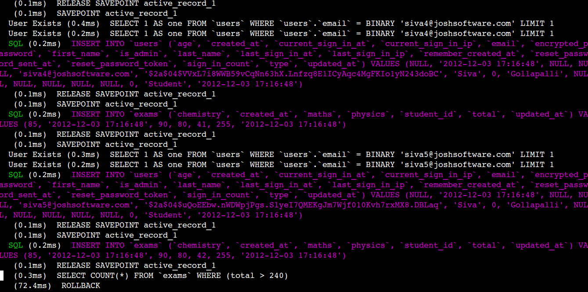

!SLIDE 
# Hidden Things in Rspec2 #

!SLIDE smaller
# What and Why RSpec?

* Rspec = Ruby specifications
* A ruby testing framework which will automate your testing effort into executable examples. 

!SLIDE smaller 
# Installation

* To install Rspec for Rails project add rspec-rails on gemfile which will install :
  * rspec
  * rspec-core
  * rspec-matchers
  * rspec-mocks
  * rspec-rails

!SLIDE commandline incremental

# Generators

    $ rails g rspec:install
    Install rspec for your rails project

    $ rails g rspec:model <file_name>
    generate model spec

    $ rails g rspec:controller <file_name> 
    generate controller spec

    $ rails g rspec:integration <file_name>
    generate request spec

!SLIDE smaller

#Syntax
    @@@ruby
    # model spec looks like
    describe MODEL_NAME do
      it "it does something"
    end
* All share same set of syntax but implementation will be different.

!SLIDE incremental smaller

# Spec types:

* Model specs
* Controller specs
* Request specs
* View specs
* Helper specs

!SLIDE subsection
# Model Specs

!SLIDE incremental smaller

!SLIDE smaller
# Relationship specs
    @@@ruby
    # Model Relationships
    has_many :exams   
    belongs_to :student
    has_one :profile
    has_many :reports, :through => :exams
    
    # specs for relationships using shoulda-matchers
    it { should have_many(:exams) }
    it { should belong_to(:student) }
    it { should have_one(:profile) }
    it { should have_many(:reports).through(:exams) }

!SLIDE smaller
# Validation specs
    @@@ruby
    validates :first_name, presence: true
    validates :email, uniqueness: true
    validates :email, format: { :with => Deivse.email_regexp } 

    it { should validate_presence_of(:first_name) }
    it { should validate_uniqueness_of(:email) }
    it { should validate_format_of(:email).with('siva@joshsoftware.com') }

!SLIDE smaller

# Callbacks
    @@@ruby
    # app/models/exam.rb
    after_validation :calculate_total

    # spec/models/exam_spec.rb
    it { should callback(:calculate_total).after(:validation) }

!SLIDE smaller

# Specs for user defined methods
    @@@ruby 
    # app/models/exam.rb
     def calculate_total
       update_attribute(:total, maths + chemistry + physics)
     end
    
    # spec/models/exam_spec.rb
     it "should calculate total after exam has saved" do
       exam = create(:exam)
       expected_total = exam.maths+exam.physics +exam.chemistry
       exam.reload.total.should eq(expected_total)
     end

!SLIDE smaller
# Specs for scopes
    @@@ruby
    # app/models/exam.rb
    scope :top_performances, where('total > ?', 240)
 
    # spec/models/exam_spec.rb
    context "#top_performances" do
     it "should collect exams whose total is greater than 240" do
      exams = create_list(:exam, 3, maths: 90, 
                          physics: 80, chemistry:85)
 
      expect(Exam.top_performances.count).to eq(3)
     end
    end

!SLIDE subsection 

# Controller Specs

!SLIDE incremental smaller

# controller methods testing
    @@@ruby
    # app/controllers/students_controller.rb
    def index
       @students = Student.all
      respond_to do |format| 
        format.html # index.html.erb
        format.json { render json: @students }
      end
    end

    # spec/controllers/students_controller_spec.rb
    describe StudentsController do
     context "#index" do
       before(:each) { create(:student) }
       it "should fetch all student objects" do
         get :index
         assigns[:students].count.should eq(1)
      end
     end
    end

!SLIDE incremental smaller

# Authetication Specs
    @@@ruby 
    # app/controller/students_controller.rb
    before_filter :authenticate_user!
    
    # spec/controller/students_controller_spec.rb
    context "#index" do
       it "should redirect to sign_in page without login" do
         student = create(:student)
         get :index, student_id: student.id
         assert_redirected_to new_user_session_path
      end
    end

!SLIDE incremental smaller

# Authorization Specs
    @@@ruby
    # app/controllers/students_controller.rb
    class StudentsController < ApplicationController
     load_and_authorize_resource
    end

    # spec/controllers/students_controller_spec.rb
    context "#load_and_authorize_resource" do
      let!(:ability){ Ability.new(create(:admin)) }
      subject { ability }
      
      it { should be_able_to(:manage, Student.new)}
    end 

!SLIDE incremental smaller

# Filters
    @@@ruby
    # app/controllers/exams_controller.rb
    class ExamsController < ApplicationController
     before_filter :find_student, :only => [:index]
    end

    # spec/controllers/exams_controller_spec.rb
    it "there should be find_student as a before_filter for index action" do
      filters = subject._process_action_callbacks.
       select{|f| f.kind == :before && f.filter == :find_student}
      expect(filters.first.options[:only]).to eq([:index])
    end

!SLIDE subsection

# Request Specs

!SLIDE incremental smaller

# Request specs

* Introduced in Rspec2
* when you want to test multiple methods of diff. controllers
* you can do implementation using capybara or Rspec

!SLIDE smaller

# Scenario
* Admin wants to login and enters exam details of a student

!SLIDE smaller
# Snippet
    @@@ruby
    # spec/request/exams_spec.rb
    describe "Given admin wants to enter exam details of a student" do
      before(:each) do
        admin = create(:admin)
        sign_in admin
      end
   
      context "when admin logged in and there exists student" do
        let!(:student) { create(:student) }
  
        it "then admin should be able to create an exam" do
          post exams_path, :exam => { :maths => 80, 
                                    :physics => 70, 
                                    :chemistry => 60, 
                                    :student_id => student.id}
          expect(student.reload.exams.count).to eq(1)
        end
      end
    end

!SLIDE subsection

# View Specs

!SLIDE incremental smaller

# View Specs
* Introduced in RSpec2
* To test whether properly used the instance variables on views or not that are defined on controllers

!SLIDE smaller
# Scenario
* Students listing page should display student email address

!SLIDE incremental smaller

# Snippet
    @@@ruby 
    # spec/views/students/index.html.erb_spec.rb
    describe "students/index" do
        it "should displays all students" do
            assign(:students, [create(:student)])
            render
  
            expect(rendered).to include("siva@joshsoftware.com")
        end
    end

!SLIDE subsection
# Helper Specs

!SLIDE incremental smaller

# Helper Specs
* Introduced in Rspec2
* Used to test helper methods 

!SLIDE incremental smaller

# Helper Specs

    @@@ruby
    # app/helpers/exams_helper.rb
    module ExamsHelper
     def remarks(exam)
       if exam.total >= 240
         "Excellent"
       elsif exam.total >= 210 and exam.total < 240
         "Good"
       elsif exam.total >= 180 and exam.total < 210
         "Average"
       elsif exam.total < 180
       "Below Average"
      end
     end 
    end   

!SLIDE incremental smaller

# Helper Specs
    @@@ruby
    # spec/helpers/exams_helper_spec.rb
    describe ExamsHelper do
     context "#remarks" do
       it "should render 'Excellent' if total is greater than 240" do
         exam = create(:exam, maths: 80, physics: 80, chemistry: 80)
   
         expect(remarks(exam)).to eq('Excellent')
       end
     end
    end

!SLIDE subsection

# Hooks

!SLIDE smaller incremental

# :each 

* before(:each) : Used to define some common code which will be executed before every example executes.
    *  ex: dummy data creation
* after(:each) : Used to define some common code which will be executed after every example executes.
    * ex: clean up database
* around(:each) : Used to define some common code which will be executed before and after every example executes.

!SLIDE smaller incremental

# :all 

* before(:all) : Execute before all examples on an example group
* after(:all) : Execute after all examples on an example group

!SLIDE smaller incremental

# :suite 

* before(:suite) : Executes before suite start executing
* after(:suite) : Executes after suite execution completed

!SLIDE smaller incremental

# Execution order

* before suite
* before all
* before each
* after  each
* after  all
* after  suite

!SLIDE smaller 

# Execution order

    @@@ruby
    describe "example_group1" do
        before(:all) { } # Executes first
        describe "example_group2" do
            before(:each)  { } # Executes last
        end
    end
 before(:all) will executes before than before(:each) 

!SLIDE smaller 
# Execution order
    @@@ruby
    describe "example_group1" do
        after(:all) { } # Executes last
        describe "example_group2" do
            after(:each)  { } # Executes first
        end
    end
 after(:all) will executes after than after(:each) 

!SLIDE smaller 
# Execution order
    @@@ruby
    describe "example_group1" do
        before(:each) { } # Executes last
        describe "example_group2" do
            before(:all)  { } # Executes first
        end
    end
 innermost before(:all) will execute first than outermost before(:each)

!SLIDE smaller 
# Execution order
    @@@ruby
    describe "example_group1" do
        after(:all) { } # Executes last
        describe "example_group2" do
            after(:each)  { } # Executes first
        end
    end
 innermost after(:each) will execute first than outermost outermost after(:all)

!SLIDE smaller 
# Execution order
    @@@ruby
    describe "example_group1" do
        before(:all) { } # Executes last
    end

    Rspec.congifuration do |c|
        c.before(:suite) { }  #Executes first
    end
 before(:suite) executes first than before(:all)

!SLIDE smaller

# Execution order
    @@@ruby
    describe "example_group1" do
        after(:all) { } # Executes first
    end

    Rspec.congifuration do |c|
        c.after(:suite) { }  #Executes last
    end
 after(:all) executes first than after(:suite)

!SLIDE subsection

# spec_helper.rb

!SLIDE smaller

# Loads Test Environment

* ENV["RAILS_ENV"] ||= 'test'
* require File.expand_path("../../config/environment", __FILE__)

!SLIDE smaller incremental
# Data Management

* Thumb Rule: Test database should be empty before each test case run
* transactional_fixtures : run every example within a transaction
* To maintain test data on relational databases we can use transactional fixtures
* gems like database_cleaner can be used for data management

!SLIDE incremental smaller

# Data Management
    @@@ruby
    # spec/spec_helper.rb
        RSpec.configure do |c|
            c.use_transactional_fixtures = true
        end

!SLIDE

!SLIDE smaller

# support_files
    @@@ruby
      Dir[Rails.root.join("spec/support/**/*.rb")].
            each {|f| require f}
      # spec/support/helper.rb
      def sign_in(admin) 
        post user_session_path, :user => {:email => admin.email, 
                                          :password => 'test123'}
      end

* requires each every file before rspec starts executing your examples
* will be used to define methods that will be used across spec files

Next slide demostrates how to stub the google API requests  

!SLIDE smaller

# Stubbing Google Map API
    @@@ruby 
     # spec/support/webmock.rb
     Spec.configure do |config|
       fixture_path = "#{::Rails.root}/spec/fixtures" 
       dir = fixture_path + '/webmock/maps.google.com'
       stubs = {}
       Dir["#{dir}/**/*"].each  do |path|
        next  if File.directory? path
        uri = path.dup
        uri.slice!( "#{dir}/" )
        if File.basename(uri) == '_directory'
            uri = File.dirname(uri)+'/'
        end
        stubs["http://maps.google.com/#{uri}"] = path
       end

       config.around(:each) do |example|
        stubs.each { |uri, path|  
          WebMock::API.stub_request(:get, uri).
            to_return( File.new(path) )  }
          WebMock.allow_net_connect!
          example.call
       end
     end

!SLIDE subsection

# Matchers and Expectations #

!SLIDE smaller

# RSpec Matchers
* check whether actual_result with expect_result
* By default Rspec provides many matchers like ==, eq etc..
* RSpec will create custom matchers on the fly for any arbitrary predicate, giving your specs a much more natural language feel.

!SLIDE smaller

# RSpec matchers
    @@@ruby

     3.should be_a_kind_of(Numeric) => 3.kind_of?(Numeric)

     [].should be_empty   => [].empty?()

    "a string".should be_an_instance_of(String) =>
                    "a string".instance_of?(String)

     3.should be_instance_of(Fixnum)=> 3.instance_of?(Fixnum) 

In addition to prefixing the predicate matchers with "be_", you can also use "be_a_"
and "be_an_", making your specs read much more naturally

!SLIDE smaller incremetal 
# Gems for matchers 

* shoulda for active_record
* mongoid_rspec for mongoid
* remarkable_mongoid for mongoid

Rspec also allow us to write our own matcher. Following slide presents a custom matcher for presence validation on mongoid

!SLIDE smaller

# Custom matcher for mongoid
    @@@ruby
      # spec/support/custom/matcher.rb
      module Custom
       module Matcher
        RSpec::Matchers.define :be_present do |attribute|
          match do |target|
            attributes = target.class.validators.collect do |a|
             if a.class == ActiveModel::Validations::PresenceValidator}.compact.flatten
              a.attributes
             end 
            end
            attributes.include?(attribute)
          end

          failure_message_for_should do |target|
            "expecting true but got false"
          end

          failure_message_for_should_not do |target|
            "expecting false but got true"
          end
        end
       end
      end

!SLIDE smaller

# RSpec Expectations 
* By default it shipped by rspec-expectations 
* Adds two instances methods(should,should_not) for every object

!SLIDE smaller
# RSpec Expectations 

    @@@ruby
    # spec/models/exam_spec.rb
     it "should calculate total after exam has saved" do
       exam = create(:exam)
       expected_total = exam.maths+exam.physics +exam.chemistry
       exam.reload.total.should eq(expected_total)
     end

!SLIDE smaller
# RSpec Expectations
    @@@ruby
    # spec/models/exam_spec.rb
     it "should calculate total after exam has saved" do
       exam = create(:exam)
       expected_total = exam.maths+exam.physics +exam.chemistry
       expect(exam.reload.total).to eq(expected_total) 
     end

* Rspec2 has introduced new syntax called 'expect' which will give more readbility than should or should_not

!SLIDE smaller
# RSpec Expectations
    @@@ruby
    # spec/spec_helper.rb
    config.expect_with :rspec do |c|
        # Disable the `expect` sytax...
        c.syntax = :should

        # ...or disable the `should` syntax...
        c.syntax = :expect

        # ...or explicitly enable both
        c.syntax = [:should, :expect]
    end

* RSpec also allows us which syntax we want to use either should or expect or both

!SLIDE smaller
# Expectation Framework
    @@@ruby 
      # spec/spec_helper.rb
      RSpec.configure do |config|
        config.expect_with :stdlib
      end

      # spec/models/exam_spec.rb 
      it "should calculate total after exam has saved" do
       exam = create(:exam)
       expected_total = exam.maths+exam.physics+exam.chemistry
 
       assert exam.reload.total == expected_total, "actual total should equal to expected total"
      end
    
!SLIDE smaller incremental

# Shared Examples and Context

* Can share examples across scenarios
* Helpfull when we want to test same set of scenarios across multiple users
* You can share context or examples across scenarios
* Caution: To much of shared examples leads confusion

!SLIDE smaller

# Scenario

* Given student can see a student information whereas admin can also see a student information.

!SLIDE smaller
    @@@ruby 
     shared_examples "can_access_student_show" do
      it "user can access show action" do
        ability.should be_able_to(:show, Student.new)
      end
     end
   
     shared_context "can_access" do
      include_examples "can_access_student_show"
     end

     context "student" do
      let!(:ability){ Ability.new(create(:student)) }
      include_context "can_access"
     end
  
     context "admin" do
      let!(:ability){ Ability.new(create(:admin)) }
      include_context "can_access" 
     end

!SLIDE smaller
# 'let'
    @@@ruby
    # Example for let
    let(:student) { create(:student) }

* let : memorized the results across examples which is lazy evaluated.

!SLIDE smaller

# 'let!'
    @@@ruby
    # Example for let
    let!(:student) { create(:student) }

* let! : memorized the results across examples which executes immediately 

!SLIDE smaller

# 'specify'
    @@@ruby
    # Example for specify      
    specify { should validate_presence_of(:first_name) }

* specify : same as 'it' but main difference it make specs read in English nicer based on the body of your test.

!SLIDE smaller 

# 'subject'

    @@@ruby
    # Example for Subject
    it { should validate_uniqueness_of(:email) }

    # Example for Explicit subject
    subject { ability }
    it { should be_able_to(:manage, Student.new)}

    # Example for Attribute of subject
    its(:class) { should eq(Exam)}

* subject : It gives instance of a object on which you can apply the expectation.

!SLIDE subsection
# Helpers

!SLIDE smaller incremental

# Helpers

* We can define helpers and include helpers to example groups
* Include modules only on some examples groups

!SLIDE incremental smaller
# Helpers
    @@@ruby
     config.include FactoryGirl::Syntax::Methods
     # Example for module helper and congifuration
     FactoryGirl.create(:student) # on factory girl 3
     create(:student) # on factory girl 4

     config.include Devise::TestHelpers, :type => :controller
     # Example for include modules only on some examples groups
     sign_in create(:user)

!SLIDE subsection

# Filters

!SLIDE incremental smaller

# Filters
* Rspec allows us to filter the examples which we want to run depends upon criteria.
* Types of filters
    * inclusion : run the examples when it satifies the criteria.

    * exclusion : run the examples which didnt satifies the filter criteria.

    * run_all_when_everything_filtered : run all examples when none of examples satified the filter criteria.
    
!SLIDE smaller

# Inclusion Filters
    @@@ruby 
    # Run only model examples
    RSpec.configure do |config|
      config.filter_run_including :model => true
    end

    # Example
    describe Student, :model => true do
     specify { should validate_presence_of(:first_name) }
     it { should validate_uniqueness_of(:email) }
     it { should have_many(:exams)} 
    end
    
    #Runs examples on which model metadata has been set to true

!SLIDE smaller

# Exclusion filters
    @@@ruby 
    RSpec.configure do |c|
      c.filter_run_excluding :model => true
    end

    # Example
    describe Student, :model => false do
     specify { should validate_presence_of(:first_name) }
     it { should validate_uniqueness_of(:email) }
     it { should have_many(:exams)} 
    end
    
     # Runs except the examples on whose metadata 
     # has been set to true

!SLIDE smaller

# Run all everything filtered
    @@@ruby 
    RSpec.configure do |c|
     c.filter_run :focus => "run everything"
     c.run_all_when_everything_filtered = true
    end

    # Example
    describe Student do
     specify { should validate_presence_of(:first_name) }
     it { should validate_uniqueness_of(:email) }
     it { should have_many(:exams)} 
    end

      # If none examples has been matched with this filter, 
      # then rspec runs whole set of examples

!SLIDE subsection

# Custom configuration

!SLIDE smaller incremental 

# Default path setting
    @@@ruby
    # in .rspec file
    --default_path behavior

# Filter configuration 
      config.filter_run_including :model => true
      config.filter_run_excluding :model => true
      config.filter_run :focus => "run everything"
      config.run_all_when_everything_filtered = true
    
!SLIDE smaller

# Reference:

git@github.com:sivagollapalli/rspec-talk.git

!SLIDE subsection

# Thank You
